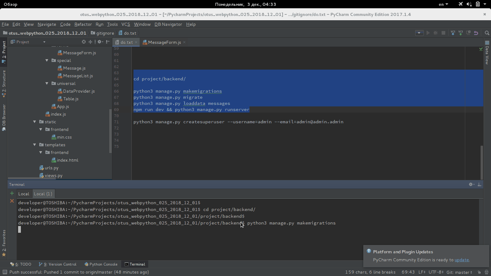

# otus_webpython_025

Simple flood chat = Django + React


## Проверка работоспособности

См. GIF-анимацию:
<kbd></kbd>

```
cd project/backend/

python3 manage.py makemigrations
python3 manage.py migrate
python3 manage.py loaddata messages
npm run dev && python3 manage.py runserver

```

В процессе:
* http://127.0.0.1:8000/
* http://127.0.0.1:8000/api/v0/messages/

Почему-то это приводит взаимодействие с SQLite к 'Send error: Forbidden'
```
python3 manage.py createsuperuser --username=admin --email=admin@admin.admin
```

* http://127.0.0.1:8000/admin/


## Авторы

* **BorisPlus** - [https://github.com/BorisPlus/otus_webpython_025](https://github.com/BorisPlus/otus_webpython_025)

## Лицензия

Свободно

## Дополнительные сведения

Проект в рамках домашнего задания курса "Web-разработчик на Python" на https://otus.ru/learning
